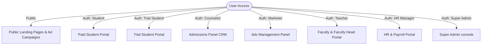
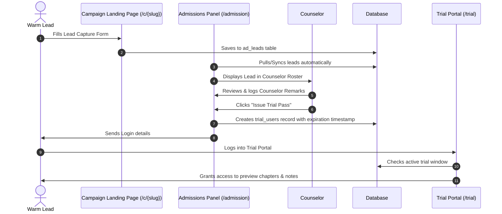
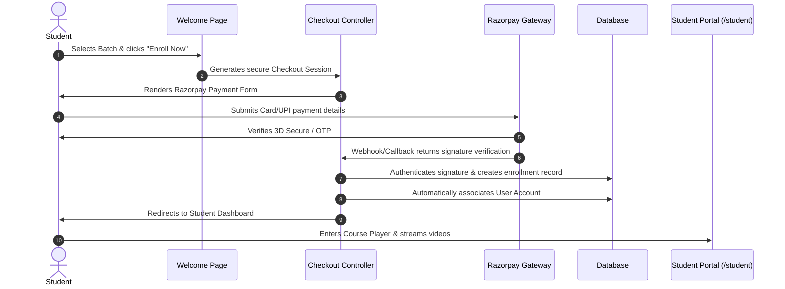
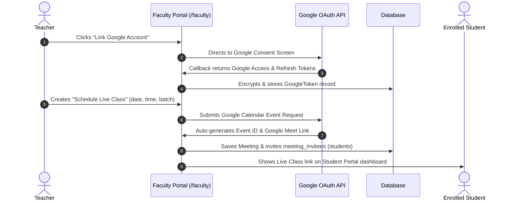

# Topper's Hope - Full System Architecture & Application Flow

Topper's Hope is a modern, enterprise-grade Ed-Tech and Learning Management System (LMS) integrated with a fully featured Employee Resource Management (ERM) system, customer CRM, recruitment engine, and marketing automation suite. 

Built on a robust, highly secure multi-portal architecture, the platform supports seamless user-role segmentation, secure streaming pipelines, integrated payment gateways, and third-party APIs.

---

## 1. Core Technologies & Tooling

The application leverages a cutting-edge software stack combining high performance with developer productivity:

### Backend Architecture

- **Laravel 12 (PHP 8.2+)**: High-performance core framework using modern Laravel routing, controller injection, middleware pipeline, queue-driven jobs, and Eloquent ORM.
- **MySQL Database**: Central transactional database. Locally configured to also host the **Session store**, **Cache driver**, and **Queue runner** (`database` connection) to ensure single-database atomic operations.
- **FPDF & FPDI**: Professional vector PDF manipulation and templating libraries used for generating dynamic documents, course certificates, and curriculum outlines.

### Frontend & Styling

- **Tailwind CSS v4**: Utilizes the bleeding-edge `@tailwindcss/vite` compiler plugin for rapid styling with ultra-small CSS bundles and premium typography.
- **Alpine.js**: Lightweight declarative reactive framework powering all client-side dynamic micro-interactions (e.g., Alpine state synchronization in forms, popup delay cycles, dynamic multi-select filters).
- **Vite 7**: Ultra-fast next-generation frontend bundler for real-time asset compilation and hot-reloading.
- **GSAP (GreenSock Animation Platform) + ScrollTrigger**: Smooth entry animations, scroll-triggered visual stagger effects, and dynamic slider sliders.

### Third-Party APIs & Integrations

- **Google Cloud APIs (OAuth 2.0 & Calendar/Meet)**: Used by teachers to seamlessly authenticate their Google accounts and auto-generate dynamic **Google Meet** links directly within the LMS scheduling dashboard.
- **Razorpay Payment Gateway**: Provides full online checkout workflows, payment capture verification, signature checkback, and automated student enrollment onboarding.

---

## 2. Key Portals & User Roles

The ecosystem divides its functionalities into seven distinct user roles and portals:

### 1. Public Website & Checkout (`/`)

- **Features**: Dynamic course and batch browser, category-specific filters, dynamic testimonials slider, live/upcoming program grids, and a checkout tunnel integrated with Razorpay.

### 2. Paid Student Portal (`/student`)

- **Features**: Dynamic Course Player, doubt tickets resolution engine, progress tracking, and interactive quizzes (auto-timed with real-time scoring and feedback).

### 3. Trial Student Portal (`/trial`)

- **Features**: A time-limited playground where prospective students can log in to view specific preview chapters, read class notes, and experience the LMS interface before buying.

### 4. Faculty & Faculty Head Portal (`/faculty`)

- **Regular Faculty**: Manage assigned subjects, upload signed streaming videos/PDFs, create multi-section quizzes (CSV import enabled), answer student doubt tickets, and grade quiz remarks.
- **Faculty Head**: Administrative control over categories, master course configurations, global batches setup, assigning teachers to courses, and tracing student rosters.
- **Live Classes**: Linking Google OAuth to schedule live online sessions with automatic Google Meet integration.

### 5. Admissions Counselor CRM (`/admission`)

- **Features**: Dynamic lead tracker pipeline (New, Contacted, Enrolled, Inactive). Offers councils timeline remarks and can issue timed dynamic **Trial Passes** to warm leads. Sync tools import registrations and campaign leads in one click.

### 6. Ads & Marketing Panel (`/ads`)

- **Features**: Creates targeted landing pages (`/c/{slug}`) with embedded lead forms. Controls global promotional delay popups on the public website.

### 7. HR & Payroll Portal (`/hr` via separate subdomain)

- **Features**: Manages employee profiles, leave balances and type limits, daily attendance logs, recruitment tracking (job postings, applications, interviews), KPI reviews, and dynamic payroll salary processing.

### 8. Super Admin Console (`/admin` via separate subdomain)

- **Features**: High-level P&L revenue/expense dashboard, ecosystem branch office configurations, developer/admin **Impersonation engine** (instantly switch into any other portal without credentials), access session killers, and security audits log tracer.

---

## 3. Core System & Data Flows

### A. Lead Capture to Trial Issuance CRM Flow

### B. Purchase & Automated Onboarding Flow

### C. Live Class Scheduling & Google Meet Sync

---

## 4. Key Security & Control Systems

Topper's Hope places a massive emphasis on data integrity, anti-piracy, and network security:

1. **Single Session Enforcement (`SingleSessionMiddleware.php`)**:
  - Tracks unique session IDs for each logged-in student. 
  - If a student logs in on a second device, the middleware instantly invalidates the prior session, preventing credentials sharing and unauthorized account distribution.
2. **Signature-Signed Secured Streaming Pipelines**:
  - Course videos (`/media/video/{filename}`) and lesson notes (`/media/pdf/{filename}`) are stored outside the public directory.
  - When a student requests content, the LMS generates a temporary **signed URL** with a high-entropy cryptographically validated signature. If the signature is expired or modified, access is instantly forbidden.
3. **Super Admin Impersonation Engine**:
  - Super admins can bypass standard auth to view staff workspaces (e.g., debugging counselor pipelines or teacher content). All impersonation events are audited.
4. **Permanent Hard-Deletion Safeguards**:
  - Database entities are managed without soft deletes (`deleted_at` column dropped), ensuring immediate hard deletions to save database overhead and guarantee clean table queries.
5. **Ecosystem Audit Logging**:
  - Every administrative action (category edit, batch deletion, staff assignment) records the actor, IP address, timestamp, and modification payload into a central `audit_logs` table for absolute accountability.

